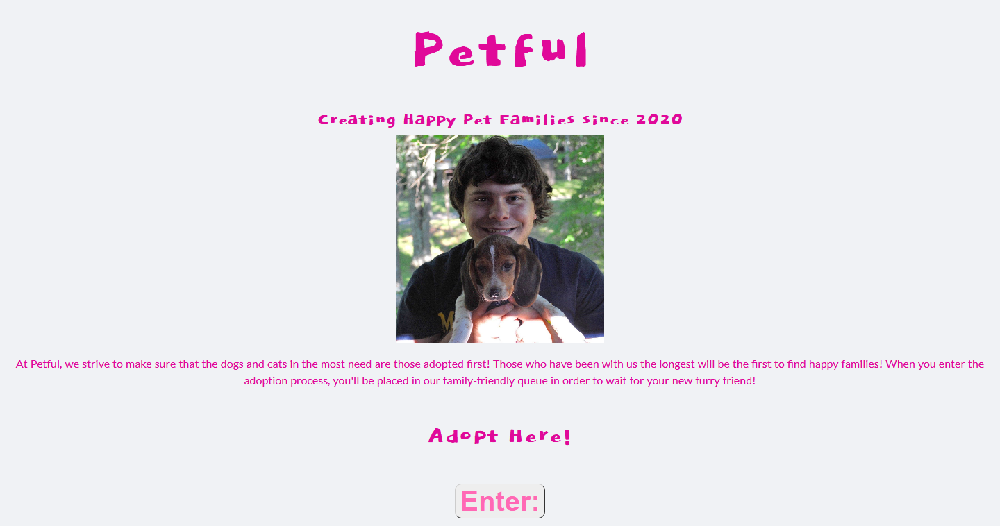
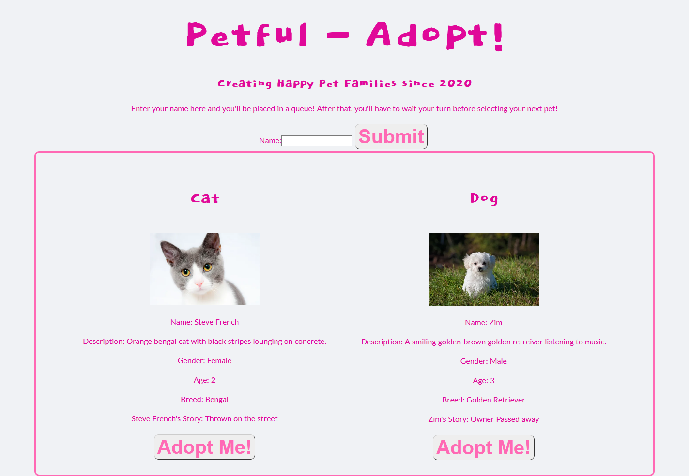

## Application
Petful

## Links
live site: https://petful-alpha.vercel.app/ 
server: https://secret-springs-25473.herokuapp.com

## Using The API
Currently the API supports GET and POST endpoints.

- Unprotected Endpoints 
  + Get People: GET (https://secret-springs-25473.herokuapp.com/people) 
  + POST A Person: POST (https://secret-springs-25473.herokuapp.com/people) 
  + DELETE People: DELETE (https://secret-springs-25473.herokuapp.com/people) 
  + Get Pets: GET (https://secret-springs-25473.herokuapp.com/pets) 
  + DELETE Pets: DELETE (https://secret-springs-25473.herokuapp.com/pets) 

## Screen Shots
 

### Summary
This app helps users implement the spaced repetition technique to help users learn ten preloaded French words.
New Users can create an account. Returning users can log in and begin practicing with instant feedback and
reinforcement.

## Technologies
  - React
  - Node.js
  - JavaScript
  - Express
